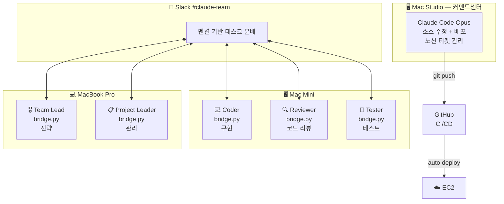

## Claude Team 구조



### bridge.py 동작 방식

```
Slack 멘션 수신 → bridge.py → Claude CLI subprocess → 결과를 Slack 스레드로 응답
```

| 머신 | 역할 | 모델 |
|------|------|------|
| Mac Studio | 커맨드센터 (직접 운영) | Opus |
| Mac Mini | Coder, Reviewer, Tester | Sonnet |
| MacBook Pro | Team Lead, Project Leader | Sonnet |